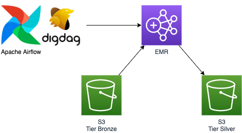

# client_log_v1_to_v2 Demo

### ETL
- 데이터 포멧 json -> Parquet 
- 데이터 구조 변경
- Timezome UTC -> KST 

### 테이블 구조
Before |  | After  
:----:|:----:|:----:
log_id| | log_id
created| |
timestamp| |created_ts
timezone| |timezone
app_version| |version
event | **->**|event
name| |name
type| |type
book_name| |
artist| | property
price| |
genre| |
